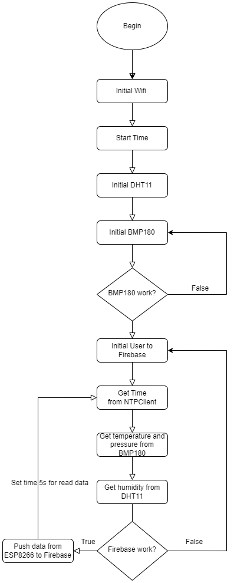

### Required
  - Node.js
  - Yarn

### Feature
  - [x] Render Realtime data to chart from ESP8266 send to Firebase.
  - [x] Animation and fill color when device active.
  - [ ] No code for control device.

### Installation
```
$ git clone https://github.com/datnguyennnx/Webpage-IoT
$ cd Webpage-IoT
$ yarn 
$ yarn dev 

Setup firebase to env file then start web.
```

### Pin Diagram
<p align="center"></p>
<p align="center">Circuit wiring</p>

### Flowchart 
<p align="center"></p>
<p align="center">How ESP get data</p>
